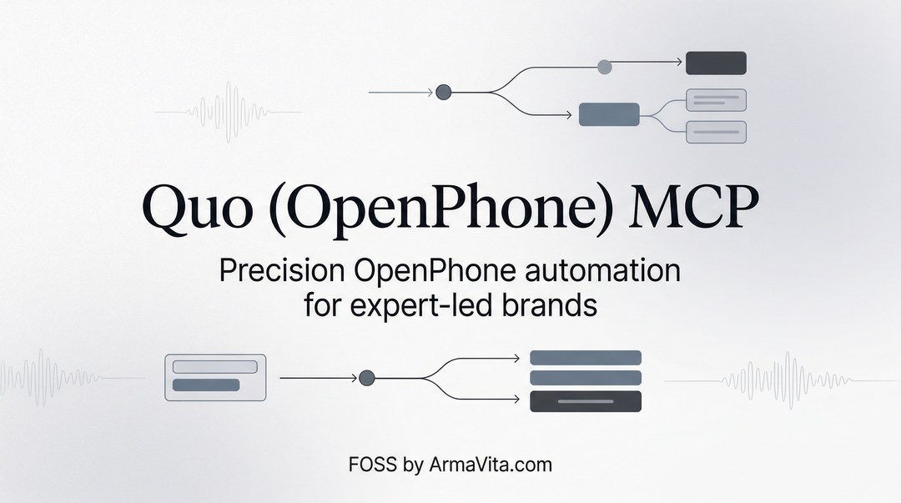

# armavita-quo-mcp

<p align="center">
  
</p>

<a href="https://glama.ai/mcp/servers/@EfrainTorres/armavita-quo-mcp">
  
</a>

<p align="center"><strong>Brought to you by <a href="https://armavita.com">ArmaVita.com</a></strong></p>
<p align="center">Need a custom implementation? <a href="https://armavita.com">Contact us</a>.</p>

`armavita-quo-mcp` is a local-first MCP server for Quo API workflows (messaging, calls, contacts, users, phone numbers, and webhooks).

- MCP transport: local `stdio`
- Runtime: Node.js 18+
- Auth: `QUO_API_KEY`
- License: AGPL-3.0-only

## Install

```bash
npm install
```

## Run

```bash
bash ./run.sh
```

`run.sh` verifies Node/npm, installs dependencies if needed, then starts the MCP server.

## Required Environment Variable

- `QUO_API_KEY`: Quo API key used for all API calls.

Optional:

- `QUO_HTTP_TIMEOUT_MS`: request timeout in milliseconds (default: `30000`).

## Quick MCP Client Config

Use this pattern in your MCP client config:

```json
{
  "mcpServers": {
    "armavita-quo-mcp": {
      "command": "bash",
      "args": ["/absolute/path/to/armavita-quo-mcp/run.sh"],
      "env": {
        "QUO_API_KEY": "YOUR_QUO_API_KEY"
      }
    }
  }
}
```

If your client launches from this folder, you can use:

```json
{
  "mcpServers": {
    "armavita-quo-mcp": {
      "command": "bash",
      "args": ["./run.sh"],
      "env": {
        "QUO_API_KEY": "YOUR_QUO_API_KEY"
      }
    }
  }
}
```

## Tool Coverage

- Messages: `send_text`, `list_messages`, `get_message`
- Conversations: `list_conversations`
- Contacts: `create_contact`, `list_contacts`, `get_contact`, `update_contact`, `delete_contact`, `get_contact_custom_fields`
- Calls: `list_calls`, `get_call`, `get_call_recordings`, `get_call_summary`, `get_call_transcription`, `get_voicemail`
- Phone numbers: `list_phone_numbers`, `get_phone_number`
- Users: `list_users`, `get_user`
- Webhooks: `list_webhooks`

## Pagination

- List endpoints expose Quo pagination parameters such as `maxResults` and `pageToken`.
- Preserve and pass forward returned page tokens to continue pagination.

## Usage Notes

- Use E.164 format for phone numbers where required (for example `+18325551234`).
- `update_contact` requires at least one field to update.
- API failures are returned from Quo status and response details, with secrets redacted in server error paths.

## Security

- Never commit real `QUO_API_KEY` values.
- Keep credentials in client/server env config, not in source files.
- Use separate keys for dev/staging/prod.

## Docs

- [Authentication](docs/authentication.md)
- [Tool Reference](docs/tool-reference.md)

## Scope

- This repository is an OSS local MCP server.
- Transport mode is local `stdio` only.
- Tool aliases are intentionally not exposed.

## Development

Syntax check:

```bash
npm run check
```

Start directly:

```bash
npm start
```

## License

GNU Affero General Public License v3.0 (AGPLv3). See `LICENSE`.